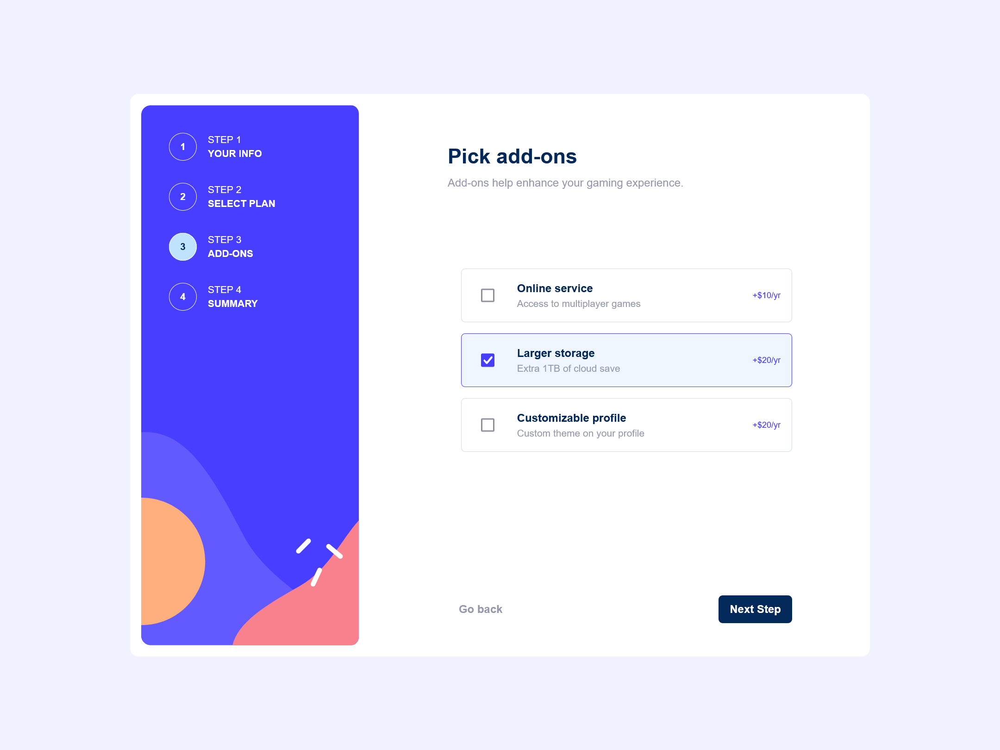

<h1 align="center">Multi Step Form</h1>

<div align="center">

&nbsp;
&nbsp;
&nbsp;
&nbsp;
</div>

## Table of contents

- [Overview](#overview)
  - [Description](#description)
  - [Screenshots](#screenshot)
  - [Links](#links)
  - [Project Setup](#project-setup)
- [My process](#my-process)
  - [Built with](#built-with)
  - [What I learned](#what-i-learned)
  - [Continued development](#continued-development)
  - [Useful resources](#useful-resources)
- [Author](#author)
- [Acknowledgments](#acknowledgments)

## Overview

### Description

Users should be able to:

- Complete each step of the sequence
- Go back to a previous step to update their selections
- See a summary of their selections on the final step and confirm their order
- View the optimal layout for the interface depending on their device's screen size
- See hover and focus states for all interactive elements on the page
- Receive form validation messages if:
- - A field has been missed
- - The email address is not formatted correctly
- - A step is submitted, but no selection has been made

### Screenshots

<div align="center">
    
    
    
    
    
     
      
</div>

### Links

- Solution URL: [GitHub](https://github.com/natalia-sampaio/multi-step-form)
- Live Site URL: [Vercel](https://multi-step-form-gules-alpha.vercel.app/)

### Project Setup

```sh
npm install
```

#### Compile and Hot-Reload for Development

```sh
npm run dev
```

#### Compile and Minify for Production

```sh
npm run build
```

## My process

### Built with

- Semantic HTML5 markup
- Responsive layout
- [TailwindCSS](https://tailwindcss.com/) - CSS framework
- [Vue.js](https://vuejs.org/) - JS framework
- - [Pinia](https://pinia.vuejs.org/) - Vuejs store
- - [Vuelidate 2](https://vuelidate-next.netlify.app/) - Vuejs validation

### What I learned

This project was especially challenging, it was my first time creating multiple pages, validating user inputs and using stores for data persistance.

I used Vuelidate 2 for the form validation.

```js
<script setup>
...imports...

const store = usePlanStore();

const formData = reactive({
  name: "",
  email: "",
  phoneNumber: ""
});

const rules = computed(() => {
  return {
    name: {
      required,
      minLength: minLength(3)
    },
    email: {
      required,
      email
    },
    phoneNumber: {
      required,
      numeric
    }
  }
});

const v$ = useVuelidate(rules, formData);

const router = useRouter();

const submitForm = async () => {
  const result = await v$.value.$validate();
  if(result) {
    store.$patch({
      name: formData.name,
      email: formData.email,
      phoneNumber: formData.phoneNumber
    })
    router.push('/select-plan')
  } else {
    router.push('/')
  }
}
</script>
```
```html
<template>
  <Card>
    <template #title>Personal info</template>
    <template #description>Please provide your name, email address and phone number.</template>
    <template #body>
      <FormItem>
            <template #label>Name</template>
            <template #error v-for="error in v$.name.$errors" :key="error.$uid" >{{ error.$message }}</template>
            <BaseInput type="text" placeholder="e.g. Casimiro Silva" aria-label="name input" v-model="formData.name" />
      </FormItem>
      <FormItem>
          <template #label>Email Address</template>
          <template #error v-for="error in v$.email.$errors" :key="error.$uid">{{ error.$message }}</template>
          <BaseInput type="email" placeholder="e.g. casimiro.silva@lorem.ip" aria-label="email input" v-model="formData.email" />
      </FormItem>
      <FormItem>
            <template #label>Phone Number</template>
            <template #error v-for="error in v$.phoneNumber.$errors" :key="error.$uid" class="text-red-600">{{ error.$message }}</template>
            <BaseInput type="phone" placeholder="e.g. +12 345 678 910" aria-label="phone number input" v-model="formData.phoneNumber" />
      </FormItem>
      </template>
      <template #buttons>
        <Button @click="submitForm" :extraClasses="'bg-blue-marine focus:animate-button_shake'" :name="'Next Step'"/>
      </template>
    </Card>
</template>
```

I used store for data persistance.
```js
import { defineStore } from 'pinia'

export const usePlanStore = defineStore('plan', {
  state: () => {
    return {
      name: "",
      email: "",
      phoneNumber: "",
      plan: "pro",
      monthlyPrice: 15,
      yearlyPrice: 150,
      yearly: false,
      addOns: []
    }
  },
  getters: {
    count: (state) => state.addOns.length,
    addOnsIsEmpty: (state) => state.count === 0,
    totalAddOnsMonthlyPrice() {
      return this.addOns.reduce((acc, addOn) => acc + addOn.monthlyPrice, 0)
    },
    totalAddOnsYearlyPrice() {
      return this.addOns.reduce((acc, addOn) => acc + addOn.yearlyPrice, 0)
    },
    totalMonthlyPrice() {
      return this.totalAddOnsMonthlyPrice + this.monthlyPrice
    },
    totalYearlyPrice() {
      return this.totalAddOnsYearlyPrice + this.yearlyPrice
    }
  }
})
```

### Continued development

In future projects I want to improve the usage of Vue.js, especially about best practices with this framework.

I also want to keep using and improving on Tailwind CSS.

I plan to make a full e-commerce site.

### Useful resources

- [Frontend Mentor](https://www.frontendmentor.io/challenges/multistep-form-YVAnSdqQBJ) - This project idea came from Frontend Mentor challenge.
- [Vue School on YouTube](https://www.youtube.com/watch?v=nBM5WTxJgD0) - Eduardo joined the Vue.js Forge Episode 2 virtual stage to showcase how you can use Pinia for global state management and in this specific use case, he'll be managing the online storefront's products of our app.
- [John Komarnicki on YouTube](https://www.youtube.com/watch?v=7alh1KowAEI) - Easy Form Validation With Vuelidate | Vue 3.

## Author

<a href="natalia.srsa@proton.me"></a>

<a href="https://www.linkedin.com/in/natalia-srs/"></a>

<a href="https://twitter.com/NataliaSRSA"></a>

## Acknowledgments

My husband [@filipedanielski](https://twitter.com/filipedanielski) who is always supporting and encouraging me.

